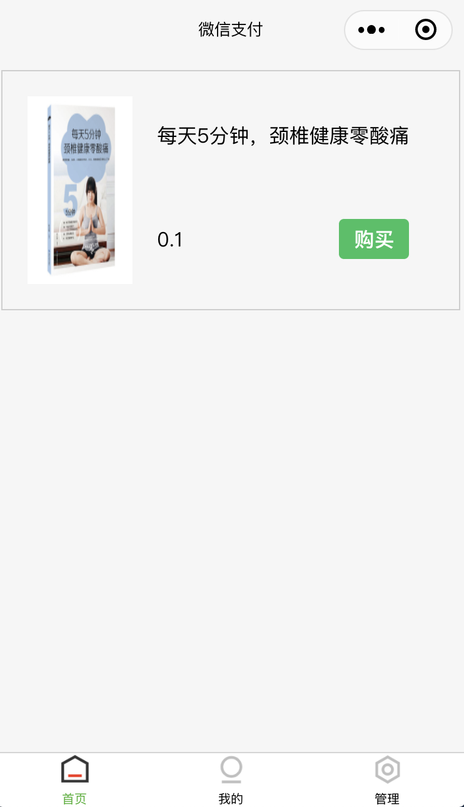
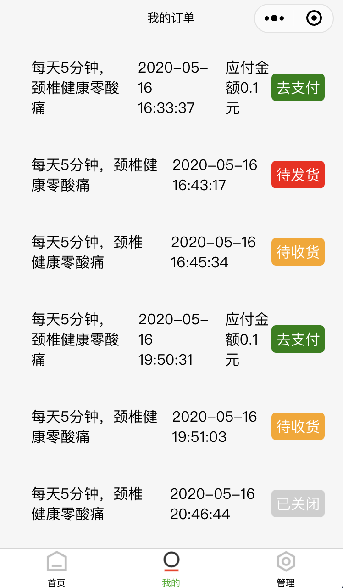
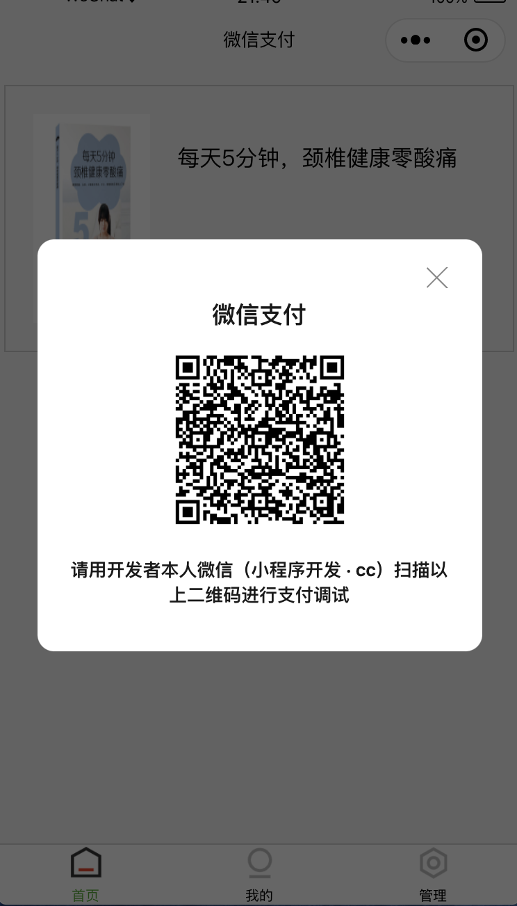
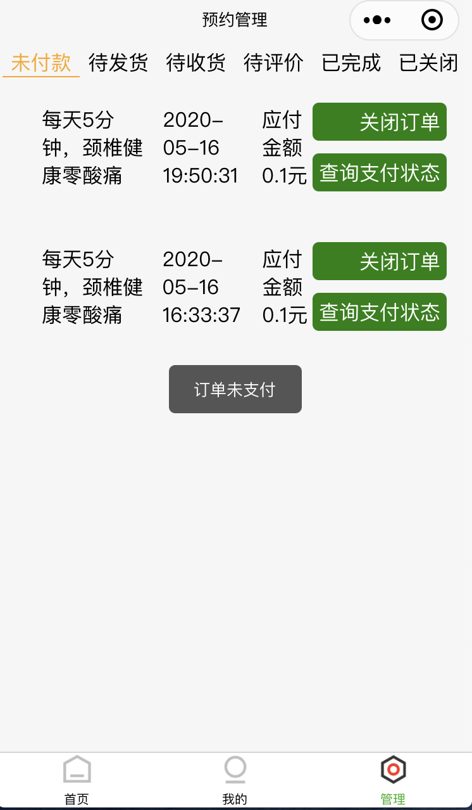
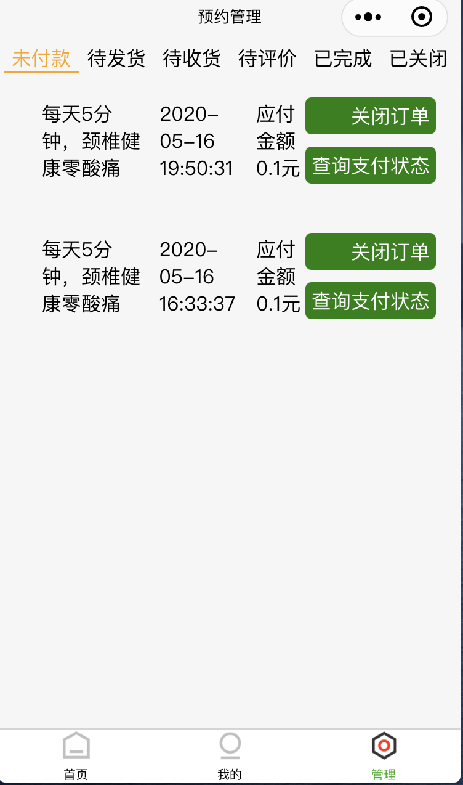

# 云开发 原生微信支付能力

这是云开发原生微信支付能力示例，其中演示了如何上手使用云开发原生微信支付能力的三大基础能力：

- 下单：通过云函数调用云开发提供的原生微信支付统一下单接口获取小程序端微信支付必要参数
- 关闭订单：通过云函数调用云开发提供的原生微信支付关闭订单接口关闭无效订单
- 订单查询：通过云函数调用云开发提供的原生微信支付查询订单接口查询订单支付状态

## 参考文档

- [云开发文档](https://developers.weixin.qq.com/miniprogram/dev/wxcloud/reference-sdk-api/open/pay/Cloud.CloudPay.html)

## 示例图片

